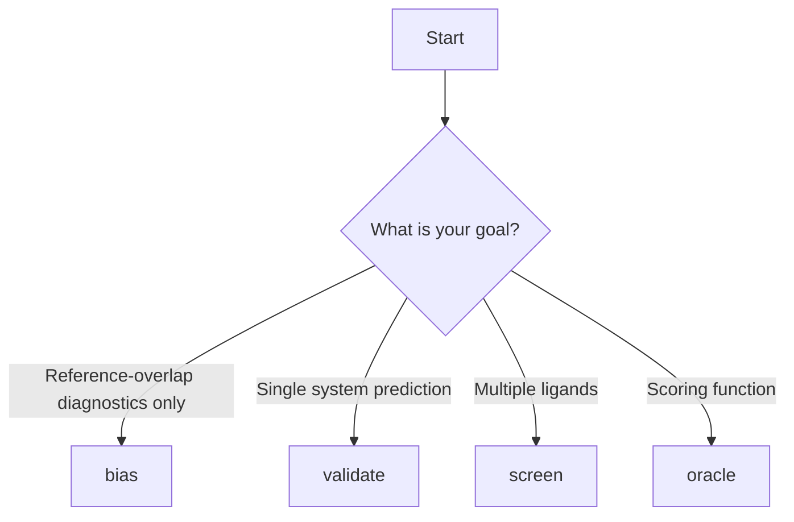

# User Guide Overview

COFOLDER provides four main commands. `bias` is a standalone diagnostic workflow,
while `validate`, `screen`, and `oracle` are runner-backed prediction workflows.

## Commands

### Bias

Inspect protein and ligand reference overlap directly from a system definition.

**Use cases:**
- Pre-cofolding decision support
- Public reference overlap inspection
- Custom reference comparison without running a backend

[Learn more →](bias.md)

### Validate

Co-fold a single protein-ligand system.

**Use cases:**
- Single system predictions
- Testing configurations
- Detailed analysis of one complex

[Learn more →](validate.md)

### Screen

High-throughput screening of ligand libraries.

**Use cases:**
- Virtual screening campaigns
- Library enumeration
- SAR analysis

[Learn more →](screen.md)

### Oracle

Use Boltz as a scoring function for molecular design.

**Use cases:**
- Optimization workflows
- Design-make-test cycles
- Integration with other tools

[Learn more →](oracle.md)

## Workflow Selection

Choose the right command for your task:



## Common Patterns

### Input File Preparation

All commands require a system YAML file defining the molecular system.

Runner-backed commands also require runner options:
1. `validate`
2. `screen`
3. `oracle`

The standalone `bias` workflow does not require `options.yaml` or a runner installation.
It needs at least one public or custom reference input, or build-mode inputs for generating
public bias-training data.

### Output Organization

`validate` writes its main outputs directly in the working directory:

```
output/
├── raw/                     # Runner-owned raw execution artifacts
├── results/
│   ├── records.jsonl        # Authoritative versioned public records
│   ├── successes.csv        # Tabular success view
│   ├── metrics.csv          # Tabular long-form metric view
│   ├── failures.csv         # Tabular failure view
│   ├── manifest.json        # Invocation and artifact manifest
│   └── structures/          # Gathered structure files
└── log.log                  # Workflow log file
```

`screen` uses that same per-run layout inside each row-specific subdirectory and publishes a consolidated contract under its top-level `results/` directory.

`oracle` writes its wrapped `validate` run under `oracle_run/` and publishes its scalar and audit records under the top-level `results/` directory.

`bias` writes diagnostic outputs under `<wrk_dir>/results/bias_train/`, including:

```
output/
├── results/
│   └── bias_train/
│       ├── records.jsonl
│       ├── metrics.csv
│       ├── protein_training_data.csv
│       ├── ligand_training_data_<CHAIN>.csv
│       ├── bias_training_data.csv
│       ├── reference_landscape_summary.csv
│       ├── bias_reference_overlap_scatter.png
│       └── bias_reference_overlap_scatter.pdf
└── log.log
```

Some valid runs vary slightly from that common layout:

- compatibility-only ligand views may be written as `ligand_training_data.csv`
- when no paired protein/ligand plotting rows exist, the workflow writes
  `bias_reference_overlap_scatter.skipped.txt` instead of plot files

### Error Handling

COFOLDER provides informative error messages. Common issues:

- Invalid SMILES strings
- Missing CCD entries
- GPU memory errors
- Invalid YAML syntax

## Performance Considerations

### GPU Utilization

- Use `devices: [0, 1]` for multi-GPU systems
- Monitor GPU memory with `nvidia-smi`
- Reduce `diffusion_samples` if OOM errors occur

### Batch Processing

For screening large libraries:

1. Split libraries into smaller batches
2. Run parallel jobs on multiple GPUs
3. Combine results post-processing

### Reproducibility

- Use a fixed random seed with `--seed`
- Document COFOLDER version
- Save all configuration files

## Next Steps

Explore detailed guides for each command:

- [Bias Command →](bias.md)
- [Validate Command →](validate.md)
- [Screen Command →](screen.md)
- [Oracle Command →](oracle.md)
