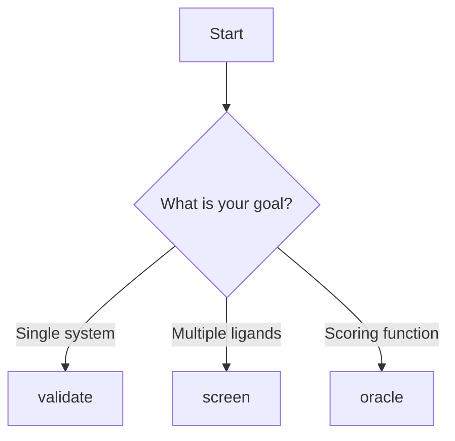

# User Guide Overview

COFOLDER provides three main commands for different co-folding workflows.

## Commands

### Validate

Co-fold a single protein-ligand system.

**Use cases:**
- Single system predictions
- Testing configurations
- Detailed analysis of one complex

[Learn more →](validate.md)

### Screen

High-throughput screening of ligand libraries.

**Use cases:**
- Virtual screening campaigns
- Library enumeration
- SAR analysis

[Learn more →](screen.md)

### Oracle

Use Boltz as a scoring function for molecular design.

**Use cases:**
- Optimization workflows
- Design-make-test cycles
- Integration with other tools

[Learn more →](oracle.md)

## Workflow Selection

Choose the right command for your task:



## Common Patterns

### Input File Preparation

All commands require:
1. System YAML file defining the molecular system
2. Runner options YAML file for prediction parameters

### Output Organization

`validate` writes its main outputs directly in the working directory:

```
output/
├── raw/                     # Runner-owned raw execution artifacts
├── results/
│   ├── system_metrics.csv   # Merged system-level metrics
│   ├── chain_metrics.csv    # Merged chain-level metrics
│   └── structures/          # Gathered structure files
└── log.log                  # Workflow log file
```

`screen` uses that same per-run layout inside each row-specific subdirectory and also writes top-level screening summaries such as `screen_results.csv` and `screen_results_with_scores.csv`.

`oracle` writes its wrapped `validate` run under `oracle_run/` and adds a top-level `oracle_result.csv` summary.

### Error Handling

COFOLDER provides informative error messages. Common issues:

- Invalid SMILES strings
- Missing CCD entries
- GPU memory errors
- Invalid YAML syntax

## Performance Considerations

### GPU Utilization

- Use `devices: [0, 1]` for multi-GPU systems
- Monitor GPU memory with `nvidia-smi`
- Reduce `diffusion_samples` if OOM errors occur

### Batch Processing

For screening large libraries:

1. Split libraries into smaller batches
2. Run parallel jobs on multiple GPUs
3. Combine results post-processing

### Reproducibility

- Use a fixed random seed with `--seed`
- Document COFOLDER version
- Save all configuration files

## Next Steps

Explore detailed guides for each command:

- [Validate Command →](validate.md)
- [Screen Command →](screen.md)
- [Oracle Command →](oracle.md)
