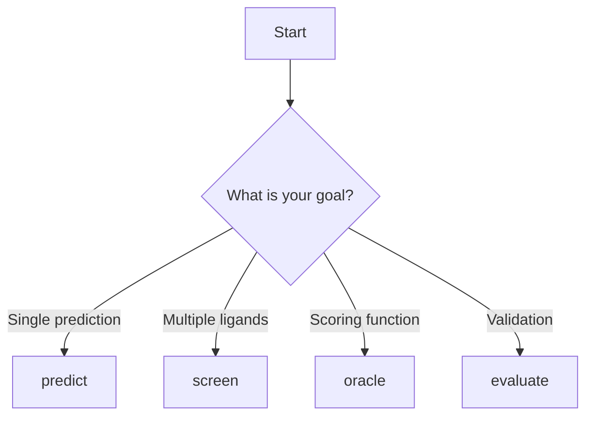

# User Guide Overview

Boltz-Lab provides four main commands for different co-folding workflows.

## Commands

### Predict

Co-fold a single protein-ligand system.

**Use cases:**
- Single system predictions
- Testing configurations
- Detailed analysis of one complex

[Learn more →](predict.md)

### Screen

High-throughput screening of ligand libraries.

**Use cases:**
- Virtual screening campaigns
- Library enumeration
- SAR analysis

[Learn more →](screen.md)

### Oracle

Use Boltz as a scoring function for molecular design.

**Use cases:**
- Optimization workflows
- Design-make-test cycles
- Integration with other tools

[Learn more →](oracle.md)

### Evaluate

Comprehensive evaluation with reference structures.

**Use cases:**
- Benchmarking predictions
- Validation against experimental data
- Repeated predictions with different seeds

[Learn more →](evaluate.md)

## Workflow Selection

Choose the right command for your task:



## Common Patterns

### Input File Preparation

All commands require:
1. System YAML file defining the molecular system
2. Boltz options YAML file for prediction parameters

### Output Organization

```
output/
├── predictions.cif          # Predicted structure
├── confidence_model_0.json  # Confidence scores
├── logs/                    # Log files
└── metadata/                # Additional metadata
```

### Error Handling

Boltz-Lab provides informative error messages. Common issues:

- Invalid SMILES strings
- Missing CCD entries
- GPU memory errors
- Invalid YAML syntax

## Performance Considerations

### GPU Utilization

- Use `devices: [0, 1]` for multi-GPU systems
- Monitor GPU memory with `nvidia-smi`
- Reduce `diffusion_samples` if OOM errors occur

### Batch Processing

For screening large libraries:

1. Split libraries into smaller batches
2. Run parallel jobs on multiple GPUs
3. Combine results post-processing

### Reproducibility

- Use fixed random seeds with `--seeds`
- Document Boltz-Lab version
- Save all configuration files

## Next Steps

Explore detailed guides for each command:

- [Predict Command →](predict.md)
- [Screen Command →](screen.md)
- [Oracle Command →](oracle.md)
- [Evaluate Command →](evaluate.md)
